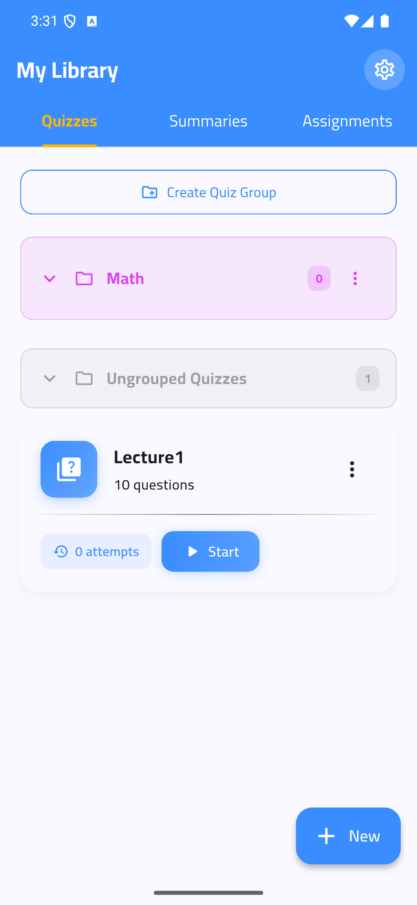
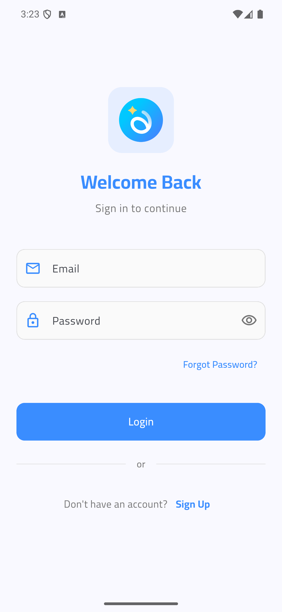
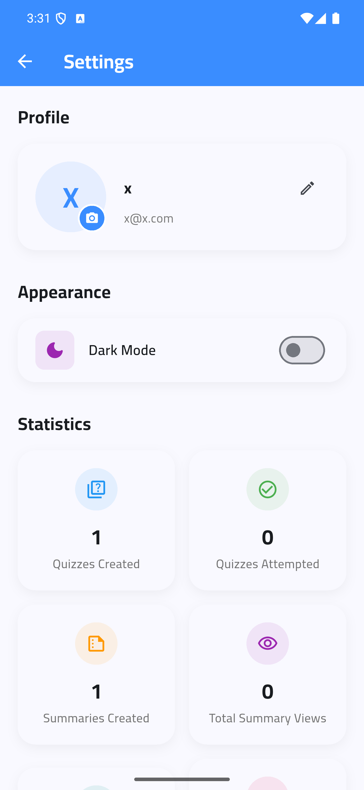
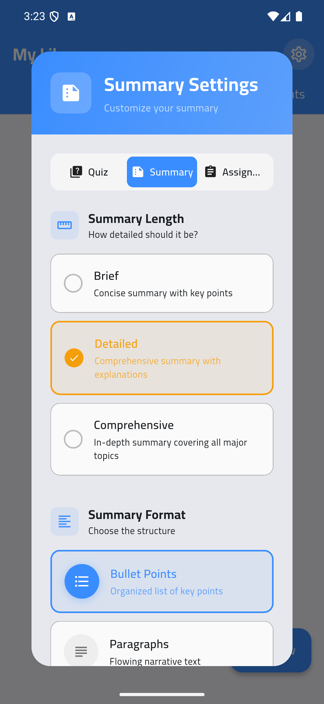
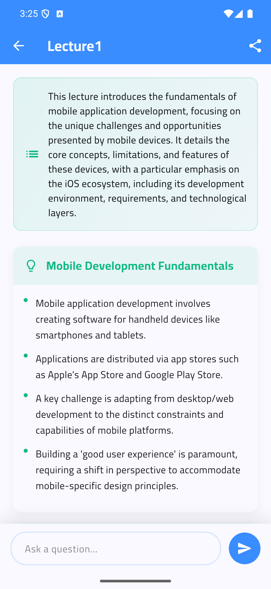
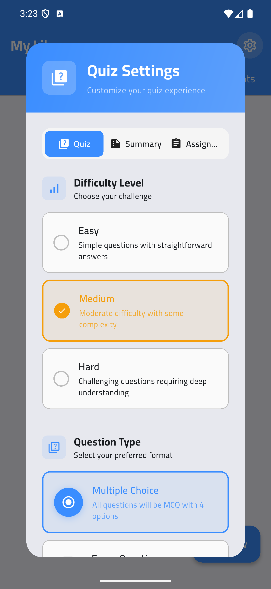
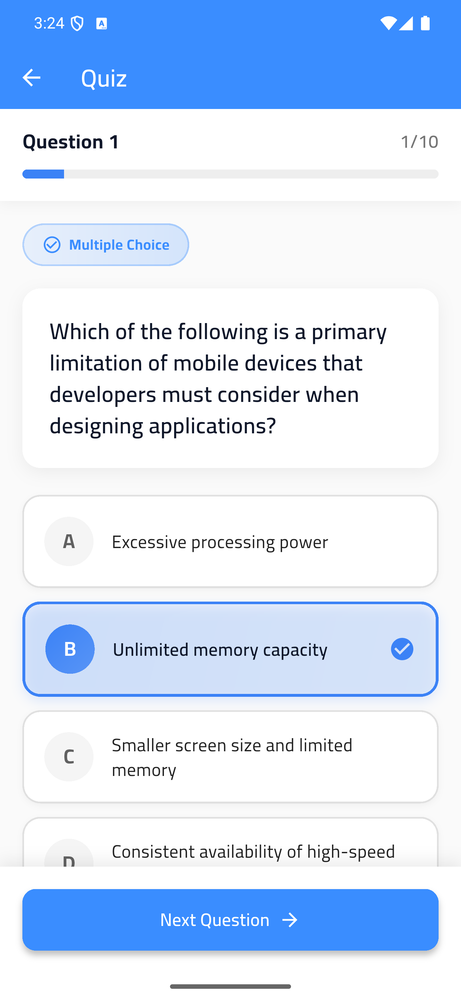
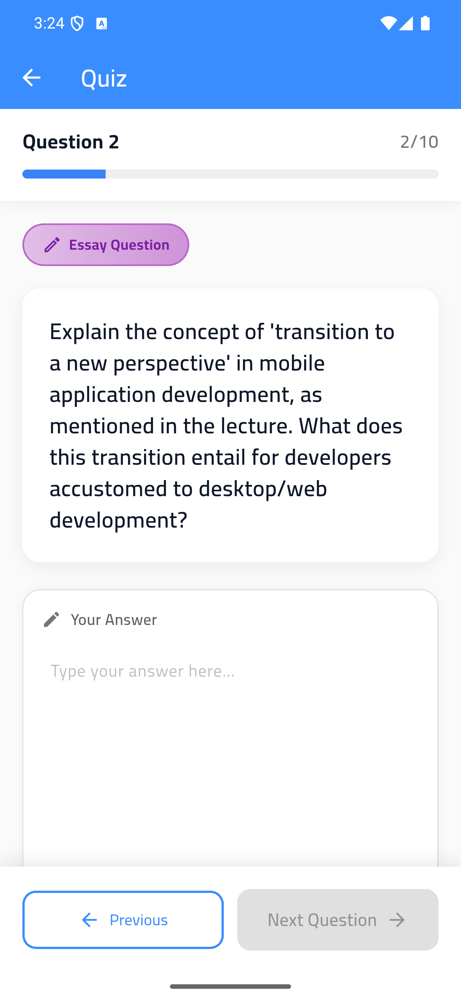
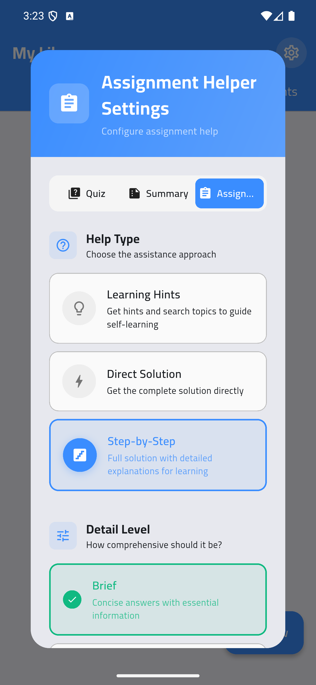
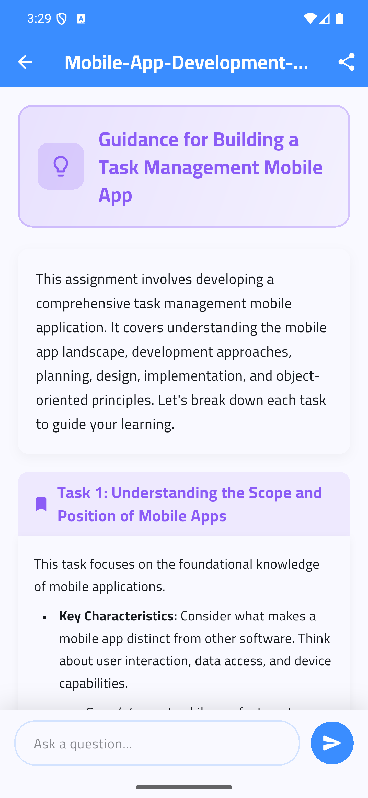

<div align="center">
  

  # Aivio
  
  **Your AI-Powered Productivity and Learning Companion**

  [](https://github.com/abdulwahed-s/aivio/releases)
  [](https://aivio-baa1e.web.app/)
</div>

---

## 🌟 Overview

**Aivio** is a cutting-edge, AI-driven educational application built using Flutter. It is designed to help students, professionals, and lifelong learners streamline their workflow by leveraging the power of Google Generative AI (Gemini). With Aivio, you can effortlessly extract insights from documents, generate study quizzes, and manage assignments—all in one beautifully crafted platform.

## ✨ Key Features

- **🤖 AI-Powered Document Summaries**: Upload PDF documents or text and let Gemini instantly generate concise, accurate summaries to save you reading time.
- **📝 Smart Quizzes generation**: Automatically create customized quizzes from your study material to test your knowledge and improve retention.
- **📚 Assignment Management**: Keep track of user assignments with an organized, intuitive dashboard.
- **👥 Group Organization**: Easily manage group work, collaborate on shared materials, and keep your tasks sorted.
- **☁️ Cloud Sync & Storage**: Your data is always safe, backed up, and seamlessly synced across your devices via Firebase Firestore and Cloud Storage.
- **🔒 Secure Authentication**: Robust and easy-to-use login/registration flow powered by Firebase Authentication.
- **🌓 Adaptive Theme**: A premium UI design featuring both Day and Night modes for comfortable reading and minimal eye strain.
- **📱 True Cross-Platform**: Optimized for Android, iOS, and Web.

## 🛠️ Technology Stack

- **Frontend**: [Flutter](https://flutter.dev) & Dart
- **Backend/BaaS**: [Firebase](https://firebase.google.com/) (Auth, Firestore, Storage)
- **AI Integration**: [Google Generative AI](https://pub.dev/packages/google_generative_ai) (Gemini API)
- **State Management**: BLoC pattern (`flutter_bloc`)

## 📸 Screenshots

### Authentication & Home
| Navigation & App Home | Authentication Flow | Profile & Settings |
| :---: | :---: | :---: |
|  |  |  |

### Document Summaries
| Summary Setup | Document Summary | Chat with Summary |
| :---: | :---: | :---: |
|  |  |  |

### Smart Quizzes
| Generate Quiz | Active Quiz |Active Quiz Essay Questions |
| :---: | :---: | :---: |
|  |  |  |

### Assignments 
| Assignment Settings | Assignment Details |
| :---: | :---: |
|  |  |

## 🚀 Getting Started

To run this project locally, follow these steps:

### Prerequisites

- Flutter SDK (version ^3.9.2)
- Dart SDK
- Firebase account with a configured project

### Installation

1. **Clone the repository**:
   ```bash
   git clone https://github.com/abdulwahed-s/aivio.git
   cd aivio
   ```
2. **Install dependencies**:
   ```bash
   flutter pub get
   ```
3. **Run the App**:
   ```bash
   flutter run
   ```

## 🤝 Contributing
Contributions, issues, and feature requests are welcome! Feel free to check the [issues page](https://github.com/abdulwahed-s/aivio/issues).

---
<div align="center">
  <i>Built with ❤️ by <a href="https://github.com/abdulwahed-s">abdulwahed-s</a></i>
</div>
